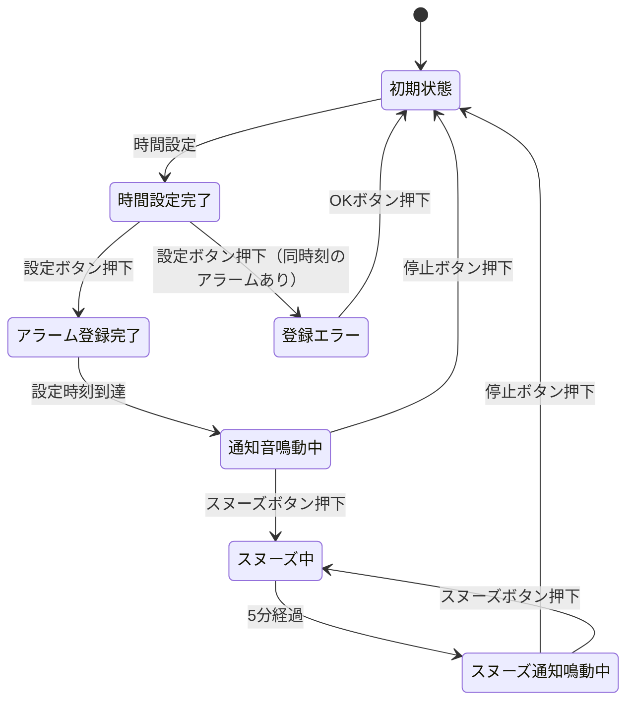

# アラーム状態遷移図

```mermaid
stateDiagram-v2
    [*] --> 初期状態
    初期状態 --> 時間設定完了 : 時間設定
    時間設定完了 --> アラーム登録完了 : 設定ボタン押下
    時間設定完了 --> 登録エラー : 設定ボタン押下（同時刻のアラームあり）
    登録エラー --> 初期状態 : OKボタン押下
    アラーム登録完了 --> 通知音鳴動中 : 設定時刻到達
    通知音鳴動中 --> 初期状態 : 停止ボタン押下
    通知音鳴動中 --> スヌーズ中 : スヌーズボタン押下
    スヌーズ中 --> スヌーズ通知鳴動中 : 5分経過
    スヌーズ通知鳴動中 --> 初期状態 : 停止ボタン押下
    スヌーズ通知鳴動中 --> スヌーズ中 : スヌーズボタン押下
```