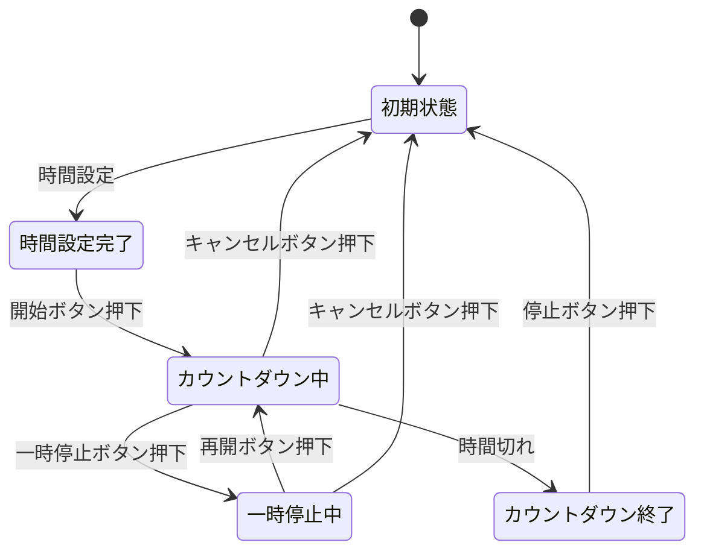

# タイマー状態遷移図

```mermaid
stateDiagram-v2
    [*] --> 初期状態
    初期状態 --> 時間設定完了: 時間設定
    時間設定完了 --> カウントダウン中: 開始ボタン押下
    カウントダウン中 --> 一時停止中: 一時停止ボタン押下
    一時停止中 --> カウントダウン中: 再開ボタン押下
    カウントダウン中 --> 初期状態: キャンセルボタン押下
    一時停止中 --> 初期状態: キャンセルボタン押下
    カウントダウン中 --> カウントダウン終了: 時間切れ
    カウントダウン終了 --> 初期状態: 停止ボタン押下
```