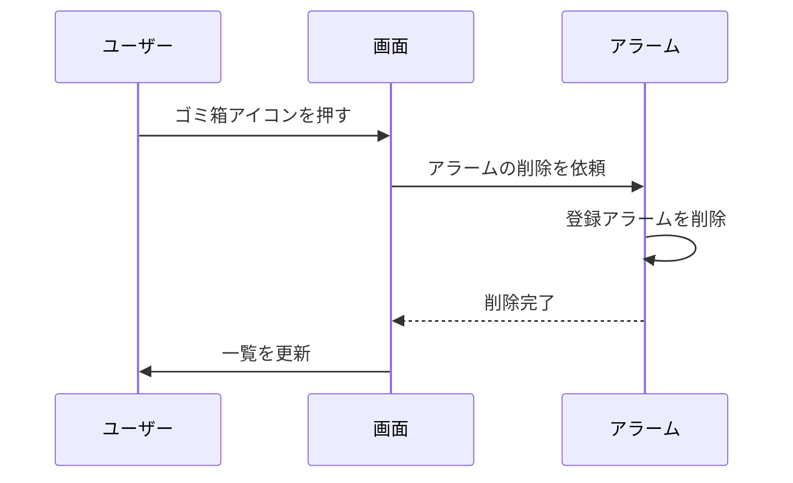

# アラームシーケンス図

## 「アラームを削除する」

```mermaid
sequenceDiagram
    participant User as ユーザー
    participant UI as 画面
    participant Alarm as アラーム

    User->>UI: ゴミ箱アイコンを押す
    UI->>Alarm: アラームの削除を依頼
    Alarm->>Alarm: 登録アラームを削除
    Alarm-->>UI: 削除完了
    UI->>User: 一覧を更新
```