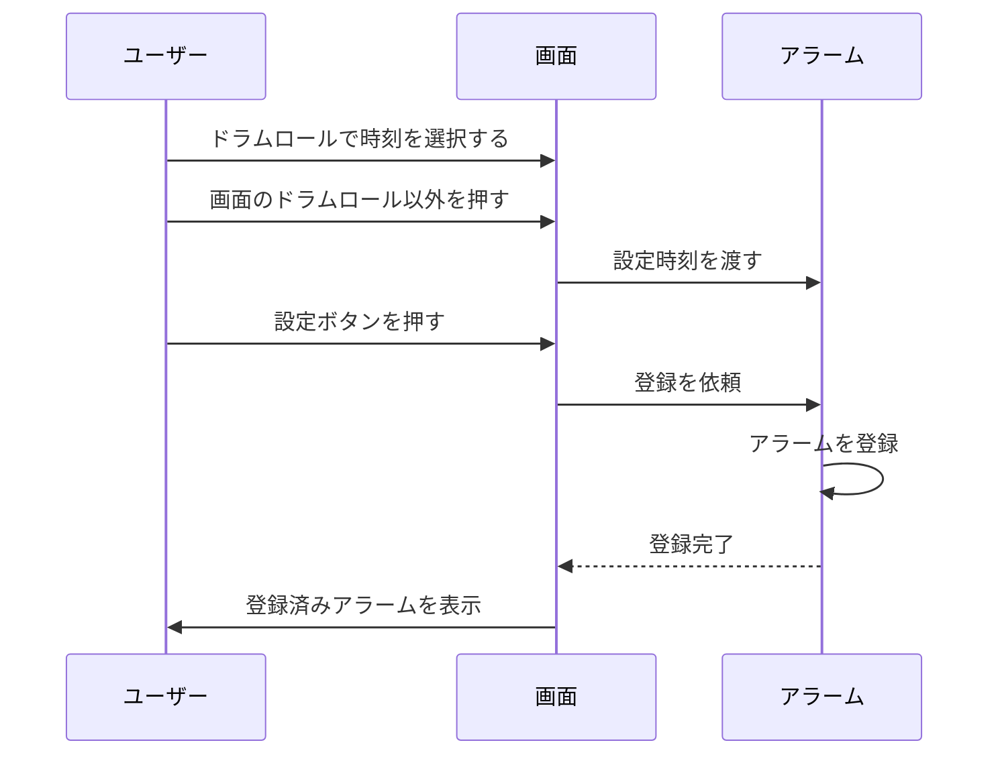

# アラームシーケンス図

## 「アラームを設定して登録する」

```mermaid
sequenceDiagram
    participant User as ユーザー
    participant UI as 画面
    participant Alarm as アラーム

    User->>UI: ドラムロールで時刻を選択する
    User->>UI: 画面のドラムロール以外を押す
    UI->>Alarm: 設定時刻を渡す

    User->>UI: 設定ボタンを押す
    UI->>Alarm: 登録を依頼
    Alarm->>Alarm: アラームを登録
    Alarm-->>UI: 登録完了
    UI->>User: 登録済みアラームを表示
```