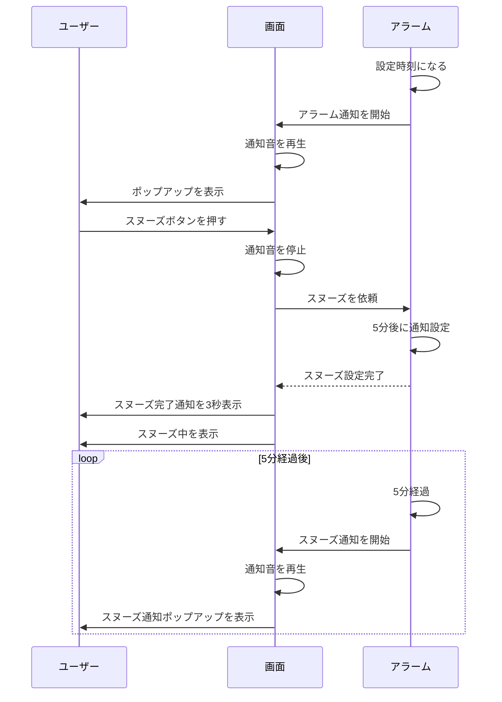

# アラームシーケンス図

## 「アラームをスヌーズする」

```mermaid
sequenceDiagram
    participant User as ユーザー
    participant UI as 画面
    participant Alarm as アラーム

    Alarm->>Alarm: 設定時刻になる
    Alarm->>UI: アラーム通知を開始
    UI->>UI: 通知音を再生
    UI->>User: ポップアップを表示

    User->>UI: スヌーズボタンを押す
    UI->>UI: 通知音を停止
    UI->>Alarm: スヌーズを依頼
    Alarm->>Alarm: 5分後に通知設定
    Alarm-->>UI: スヌーズ設定完了
    UI->>User: スヌーズ完了通知を3秒表示
    UI->>User: スヌーズ中を表示

    loop 5分経過後
        Alarm->>Alarm: 5分経過
        Alarm->>UI: スヌーズ通知を開始
        UI->>UI: 通知音を再生
        UI->>User: スヌーズ通知ポップアップを表示
    end
```