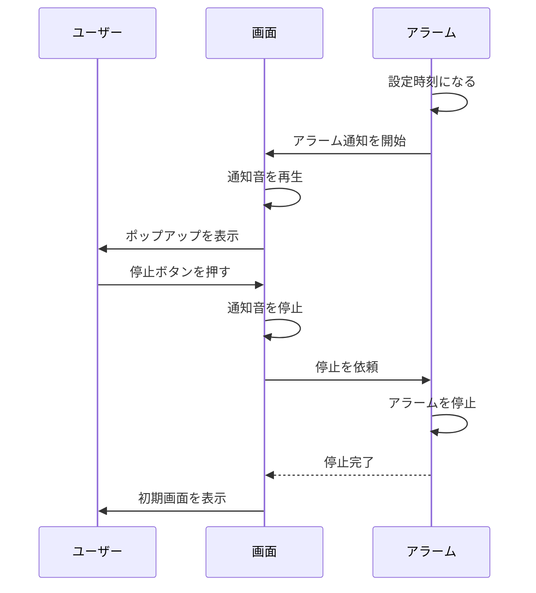

# アラームシーケンス図

## 「アラームが鳴って停止する」

```mermaid
sequenceDiagram
    participant User as ユーザー
    participant UI as 画面
    participant Alarm as アラーム

    Alarm->>Alarm: 設定時刻になる
    Alarm->>UI: アラーム通知を開始
    UI->>UI: 通知音を再生
    UI->>User: ポップアップを表示

    User->>UI: 停止ボタンを押す
    UI->>UI: 通知音を停止
    UI->>Alarm: 停止を依頼
    Alarm->>Alarm: アラームを停止
    Alarm-->>UI: 停止完了
    UI->>User: 初期画面を表示
```