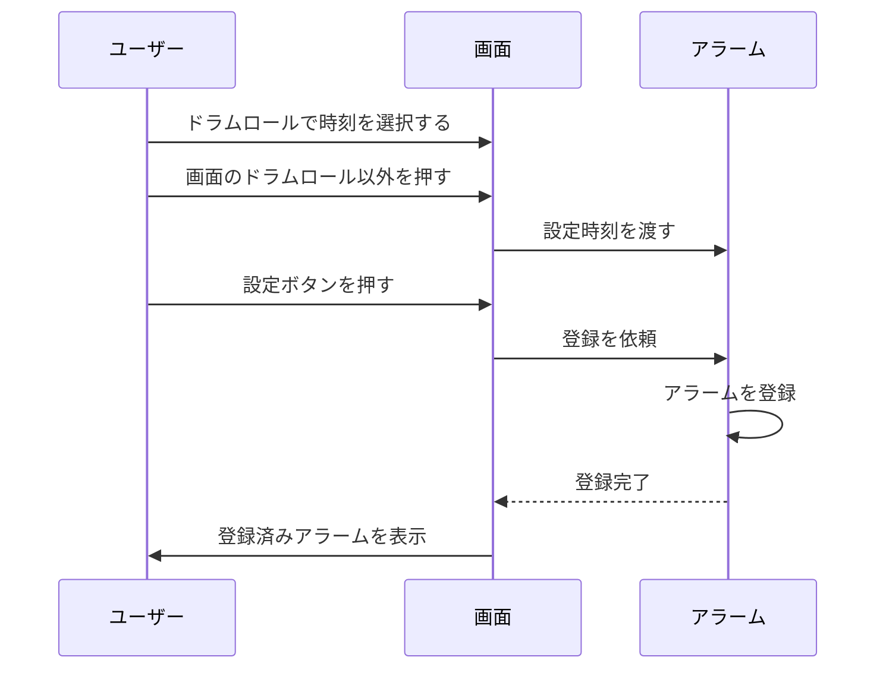
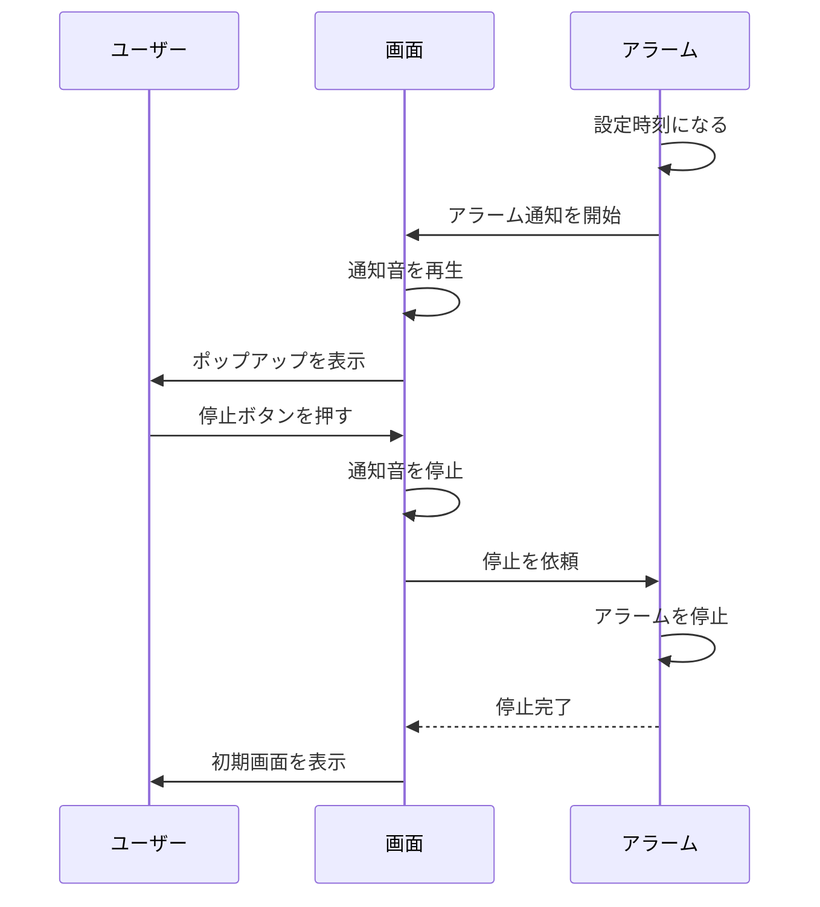
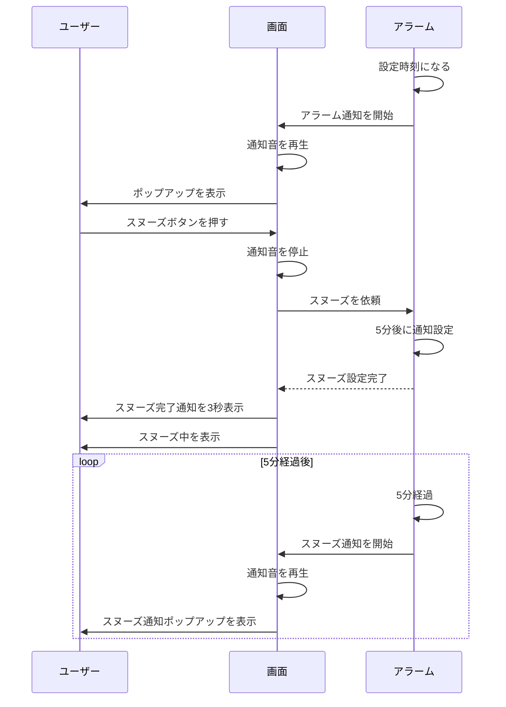
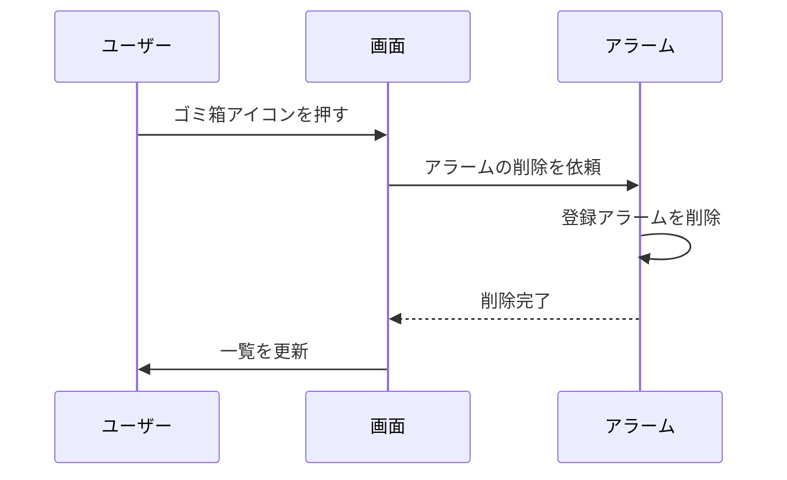

# アラームシーケンス図

## ① アラームを設定して登録する

```mermaid
sequenceDiagram
    participant User as ユーザー
    participant UI as 画面
    participant Alarm as アラーム

    User->>UI: ドラムロールで時刻を選択する
    User->>UI: 画面のドラムロール以外を押す
    UI->>Alarm: 設定時刻を渡す

    User->>UI: 設定ボタンを押す
    UI->>Alarm: 登録を依頼
    Alarm->>Alarm: アラームを登録
    Alarm-->>UI: 登録完了
    UI->>User: 登録済みアラームを表示
```

## ② アラームが鳴って停止する

```mermaid
sequenceDiagram
    participant User as ユーザー
    participant UI as 画面
    participant Alarm as アラーム

    Alarm->>Alarm: 設定時刻になる
    Alarm->>UI: アラーム通知を開始
    UI->>UI: 通知音を再生
    UI->>User: ポップアップを表示

    User->>UI: 停止ボタンを押す
    UI->>UI: 通知音を停止
    UI->>Alarm: 停止を依頼
    Alarm->>Alarm: アラームを停止
    Alarm-->>UI: 停止完了
    UI->>User: 初期画面を表示
```

## ③ アラームをスヌーズする

```mermaid
sequenceDiagram
    participant User as ユーザー
    participant UI as 画面
    participant Alarm as アラーム

    Alarm->>Alarm: 設定時刻になる
    Alarm->>UI: アラーム通知を開始
    UI->>UI: 通知音を再生
    UI->>User: ポップアップを表示

    User->>UI: スヌーズボタンを押す
    UI->>UI: 通知音を停止
    UI->>Alarm: スヌーズを依頼
    Alarm->>Alarm: 5分後に通知設定
    Alarm-->>UI: スヌーズ設定完了
    UI->>User: スヌーズ完了通知を3秒表示
    UI->>User: スヌーズ中を表示

    loop 5分経過後
        Alarm->>Alarm: 5分経過
        Alarm->>UI: スヌーズ通知を開始
        UI->>UI: 通知音を再生
        UI->>User: スヌーズ通知ポップアップを表示
    end
```

## ④ アラームを削除する

```mermaid
sequenceDiagram
    participant User as ユーザー
    participant UI as 画面
    participant Alarm as アラーム

    User->>UI: ゴミ箱アイコンを押す
    UI->>Alarm: アラームの削除を依頼
    Alarm->>Alarm: 登録アラームを削除
    Alarm-->>UI: 削除完了
    UI->>User: 一覧を更新
```