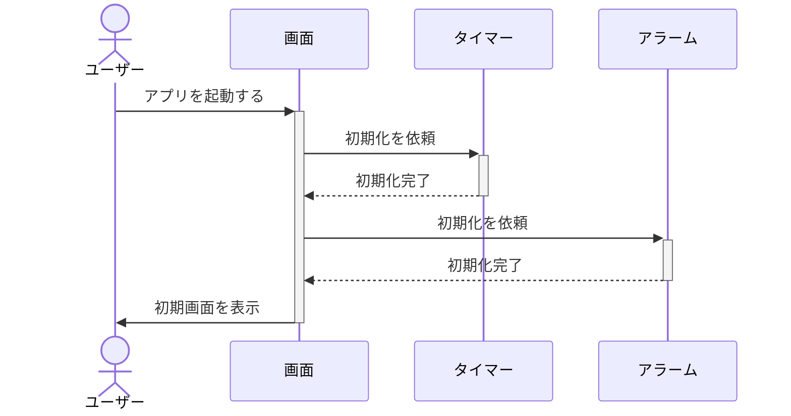
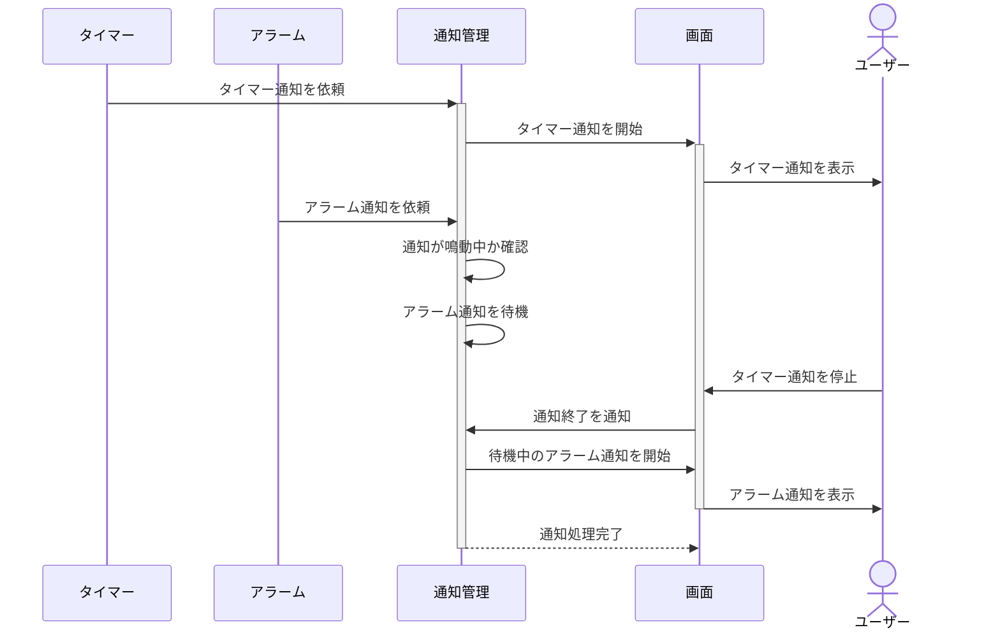
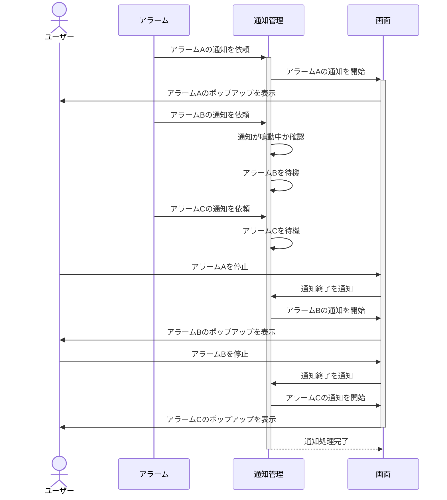
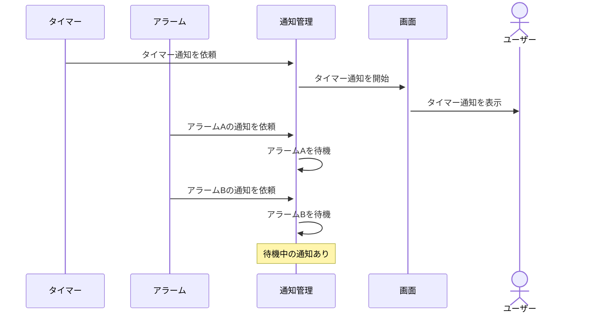

# 共通シーケンス図

## 1. アプリを起動する

## 2. 通知が競合する

> タイマー通知が鳴っている最中に、アラーム通知が発生した場合

## 3. 複数のアラーム通知が発生する

> アラームAが鳴っている間に、アラームB・Cの通知時刻になった場合

## 4. 通知が待機している状態

> 現在の通知が鳴っている間に後続の通知が発生したら、現在の通知が終わるまで待機する。 
> 現在の通知が終了したら、待機中の通知を表示する。

