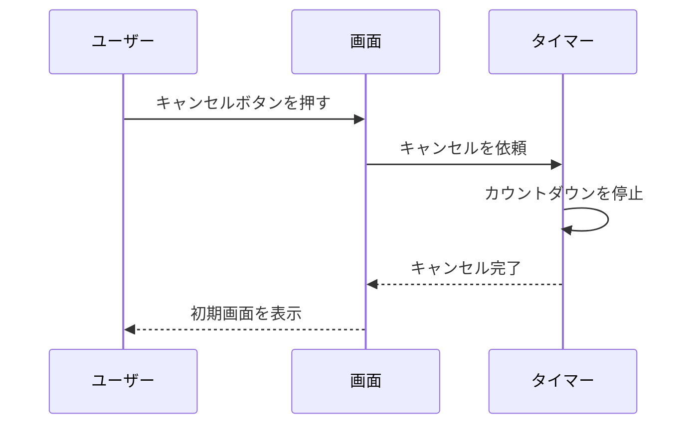

# タイマーシーケンス図

## 「タイマーをキャンセルする」

```mermaid
sequenceDiagram
    participant User as ユーザー
    participant UI as 画面
    participant Timer as タイマー

    User->>UI: キャンセルボタンを押す
    UI->>Timer: キャンセルを依頼
    Timer->>Timer: カウントダウンを停止
    Timer-->>UI: キャンセル完了
    UI-->>User: 初期画面を表示
```