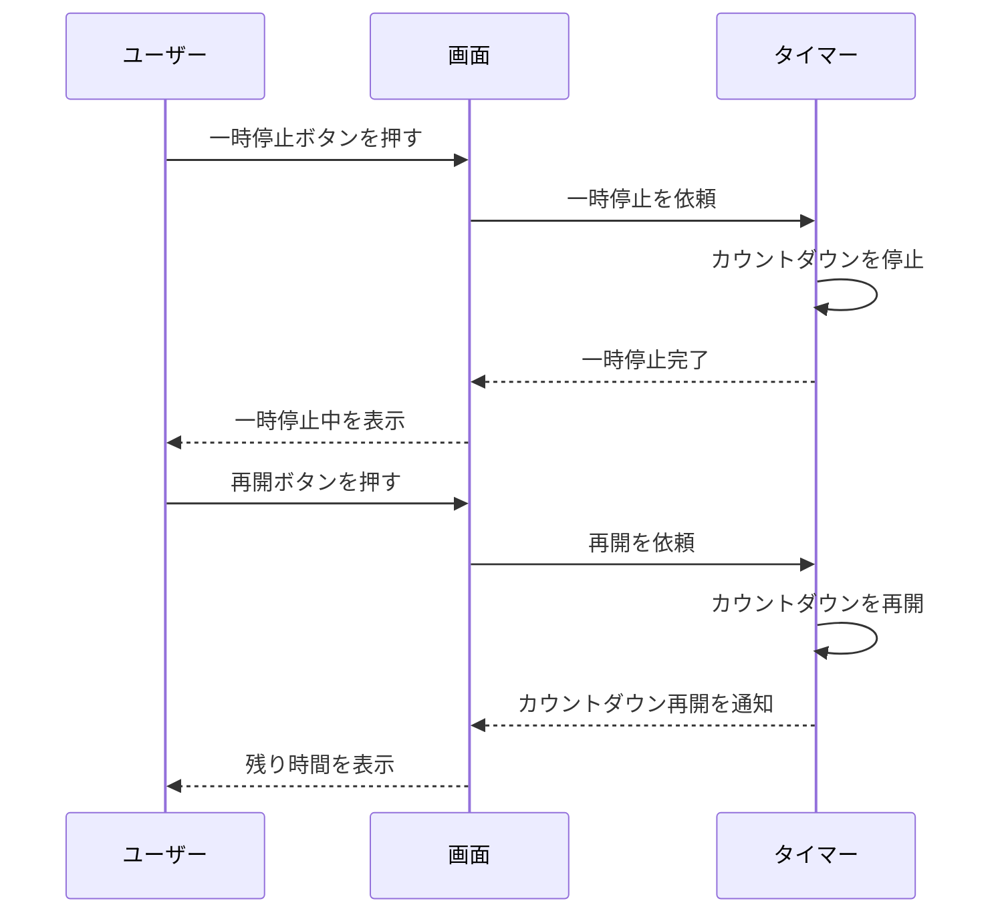

# タイマーシーケンス図

## 「タイマーを一時停止して再開する」

```mermaid
sequenceDiagram
    participant User as ユーザー
    participant UI as 画面
    participant Timer as タイマー

    User->>UI: 一時停止ボタンを押す
    UI->>Timer: 一時停止を依頼
    Timer->>Timer: カウントダウンを停止
    Timer-->>UI: 一時停止完了
    UI-->>User: 一時停止中を表示
    User->>UI: 再開ボタンを押す
    UI->>Timer: 再開を依頼
    Timer->>Timer: カウントダウンを再開
    Timer-->>UI: カウントダウン再開を通知
    UI-->>User: 残り時間を表示
```