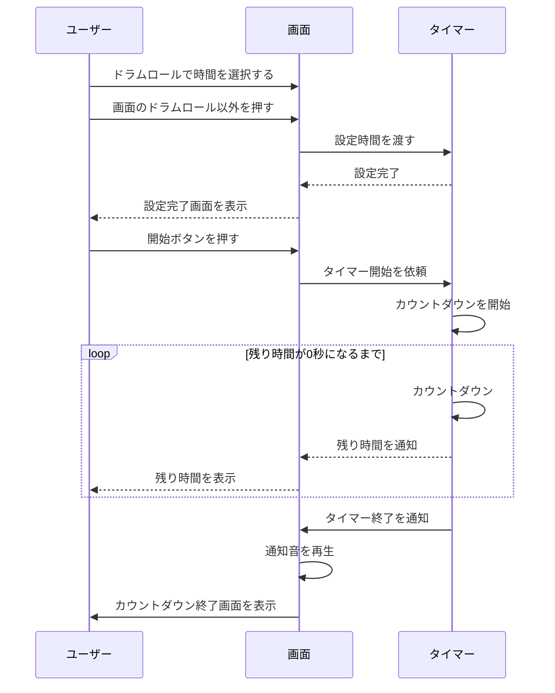

# タイマーシーケンス図

## 「タイマーを設定して開始する」

```mermaid
sequenceDiagram
    participant User as ユーザー
    participant UI as 画面
    participant Timer as タイマー

    User->>UI: ドラムロールで時間を選択する
    User->>UI: 画面のドラムロール以外を押す
    UI->>Timer: 設定時間を渡す
    Timer-->>UI: 設定完了
    UI-->>User: 設定完了画面を表示
    
    User->>UI: 開始ボタンを押す
    UI->>Timer: タイマー開始を依頼
    Timer->>Timer: カウントダウンを開始

    loop 残り時間が0秒になるまで
        Timer->>Timer: カウントダウン
        Timer-->>UI: 残り時間を通知
        UI-->>User: 残り時間を表示
    end

    Timer->>UI: タイマー終了を通知
    UI->>UI: 通知音を再生
    UI->>User: カウントダウン終了画面を表示
```