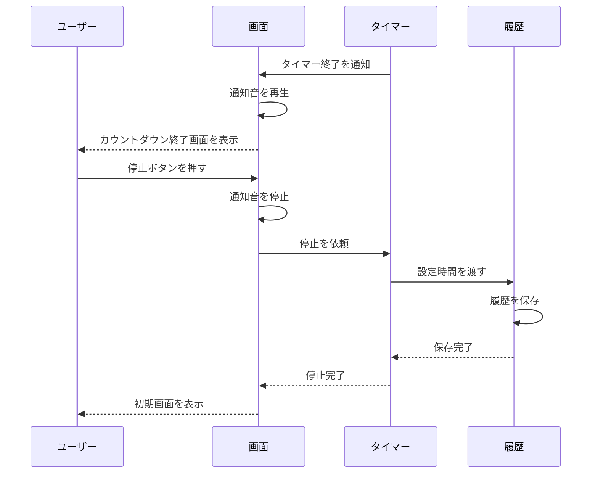

# タイマーシーケンス図

## 「タイマーが時間切れになる」

```mermaid
sequenceDiagram
    participant User as ユーザー
    participant UI as 画面
    participant Timer as タイマー
    participant History as 履歴

    Timer->>UI: タイマー終了を通知
    UI->>UI: 通知音を再生
    UI-->>User: カウントダウン終了画面を表示
    User->>UI: 停止ボタンを押す
    UI->>UI: 通知音を停止
    UI->>Timer: 停止を依頼
    Timer->>History: 設定時間を渡す
    History->>History: 履歴を保存
    History-->>Timer: 保存完了
    Timer-->>UI: 停止完了
    UI-->>User: 初期画面を表示
```