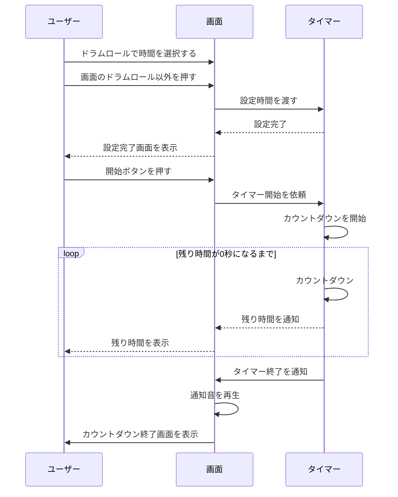
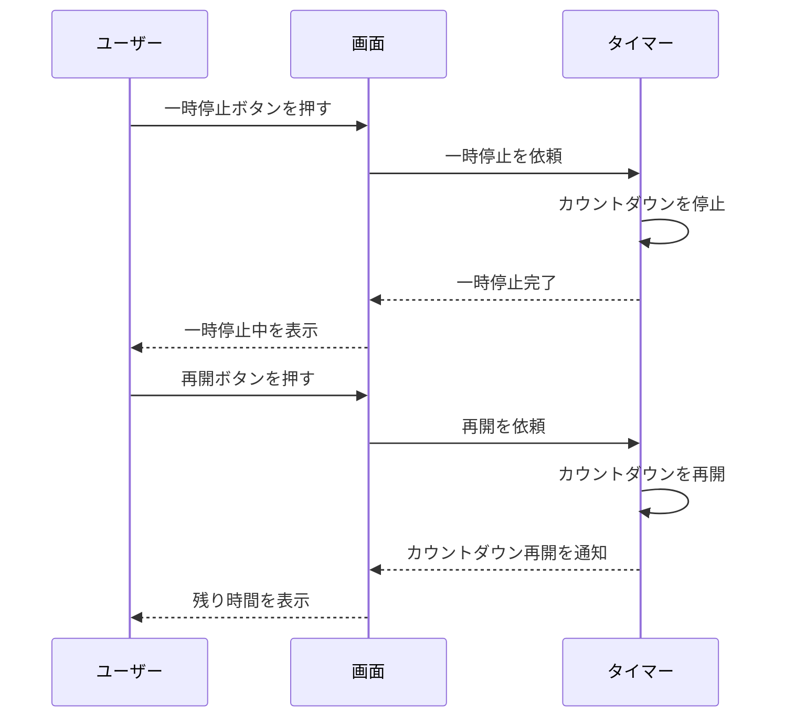
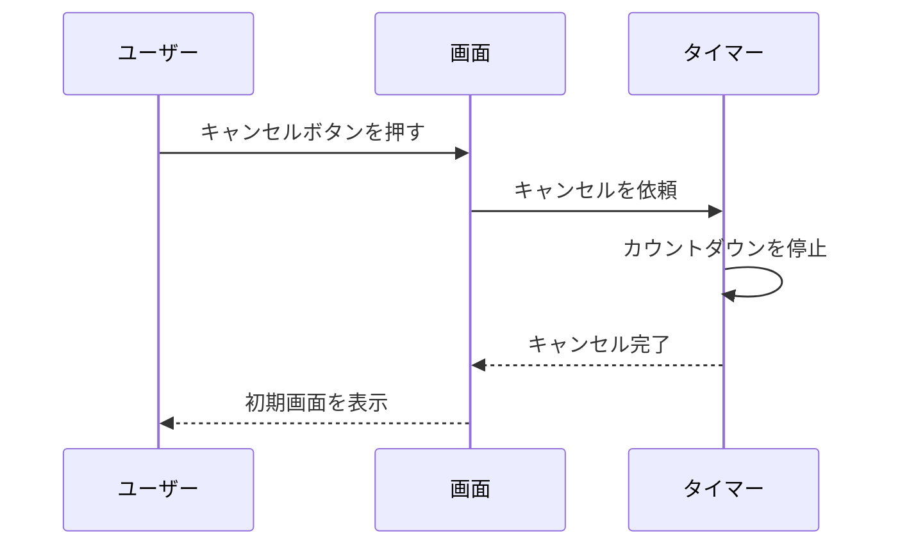
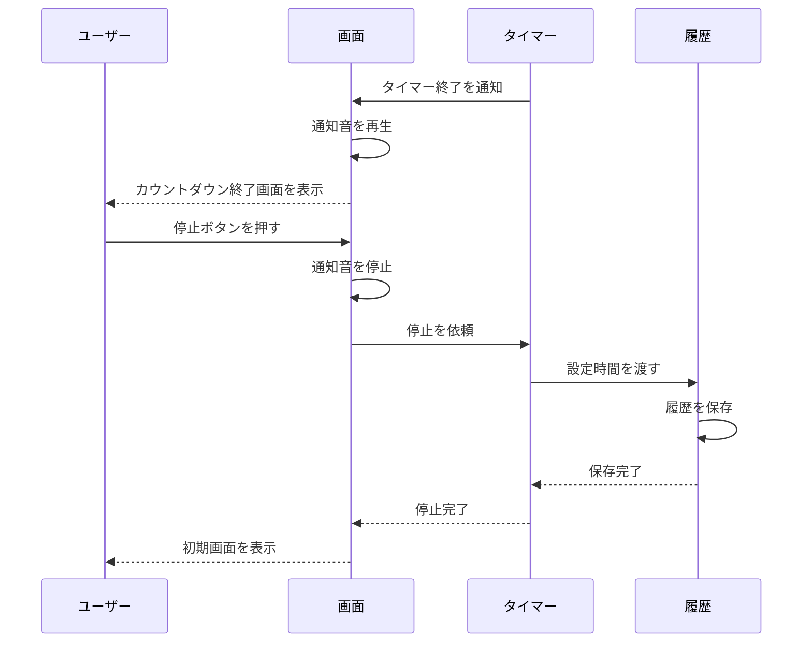

# タイマーシーケンス図

## ① タイマーを設定して開始する

```mermaid
sequenceDiagram
    participant User as ユーザー
    participant UI as 画面
    participant Timer as タイマー

    User->>UI: ドラムロールで時間を選択する
    User->>UI: 画面のドラムロール以外を押す
    UI->>Timer: 設定時間を渡す
    Timer-->>UI: 設定完了
    UI-->>User: 設定完了画面を表示
    
    User->>UI: 開始ボタンを押す
    UI->>Timer: タイマー開始を依頼
    Timer->>Timer: カウントダウンを開始

    loop 残り時間が0秒になるまで
        Timer->>Timer: カウントダウン
        Timer-->>UI: 残り時間を通知
        UI-->>User: 残り時間を表示
    end

    Timer->>UI: タイマー終了を通知
    UI->>UI: 通知音を再生
    UI->>User: カウントダウン終了画面を表示
```

## ② タイマーを一時停止して再開する

```mermaid
sequenceDiagram
    participant User as ユーザー
    participant UI as 画面
    participant Timer as タイマー

    User->>UI: 一時停止ボタンを押す
    UI->>Timer: 一時停止を依頼
    Timer->>Timer: カウントダウンを停止
    Timer-->>UI: 一時停止完了
    UI-->>User: 一時停止中を表示
    User->>UI: 再開ボタンを押す
    UI->>Timer: 再開を依頼
    Timer->>Timer: カウントダウンを再開
    Timer-->>UI: カウントダウン再開を通知
    UI-->>User: 残り時間を表示
```

## ③ タイマーをキャンセルする

```mermaid
sequenceDiagram
    participant User as ユーザー
    participant UI as 画面
    participant Timer as タイマー

    User->>UI: キャンセルボタンを押す
    UI->>Timer: キャンセルを依頼
    Timer->>Timer: カウントダウンを停止
    Timer-->>UI: キャンセル完了
    UI-->>User: 初期画面を表示
```

## ④ タイマーが時間切れになる

```mermaid
sequenceDiagram
    participant User as ユーザー
    participant UI as 画面
    participant Timer as タイマー
    participant History as 履歴

    Timer->>UI: タイマー終了を通知
    UI->>UI: 通知音を再生
    UI-->>User: カウントダウン終了画面を表示
    User->>UI: 停止ボタンを押す
    UI->>UI: 通知音を停止
    UI->>Timer: 停止を依頼
    Timer->>History: 設定時間を渡す
    History->>History: 履歴を保存
    History-->>Timer: 保存完了
    Timer-->>UI: 停止完了
    UI-->>User: 初期画面を表示
```